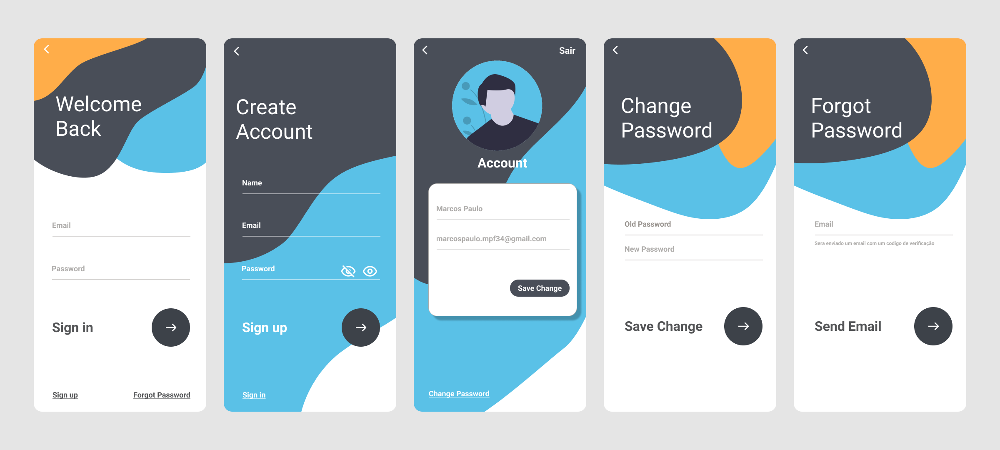

# Authentication
Projeto para registro e autenticação de usuário usando nodeJS e React Native

# Views

# Como executar o backend 
Navegue até a pasta do backend e execute o sequinte comando:
<blockquote>nodemon src/index.js</blockquote>

# Como executar o mobile 
Navegue até a pasta do mobile e execute o sequinte comando:
<blockquote>expo start</blockquote>
Lembrando que para isso é necessario ter o expo instalado

